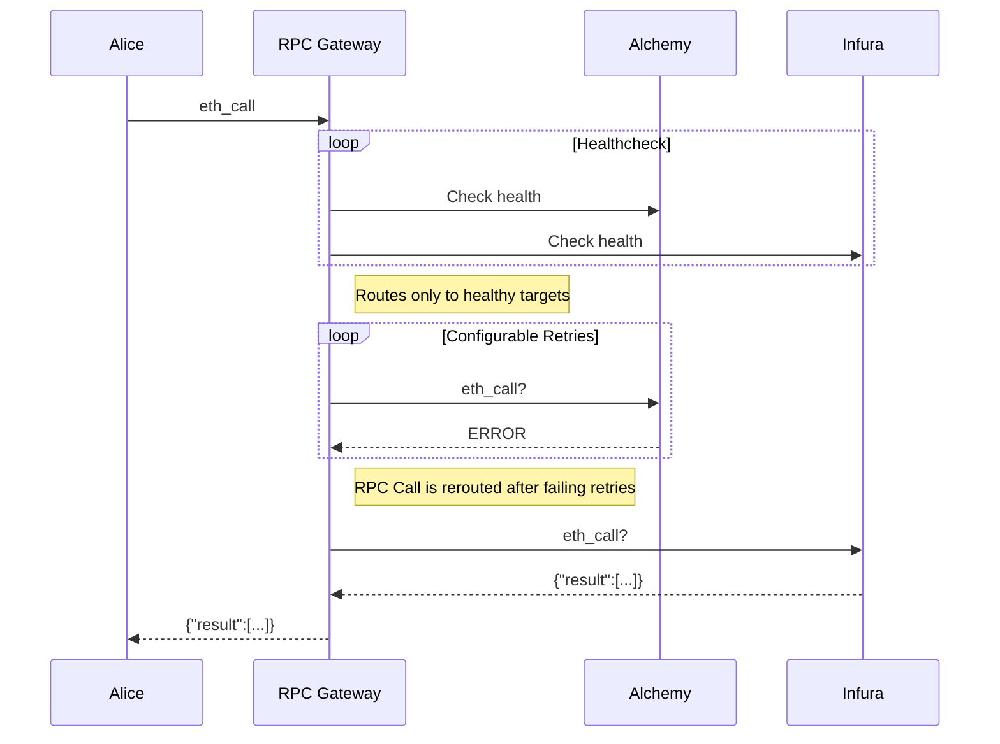

RPC Gateway
===

RPC Gateway acts as a failover proxy routing ETH RPC requests across configured RPC nodes. For every ETH RPC node(group) configured the RPC Gateway tracks its latency, current height and error rates. These are then used to determine whether or not to failover.

From a high level it simply looks like this:


The gateway assesses the health of the underlying RPC provider by:
- continuously (configurable how often) checking the blockNumber, if the request fails or timeouts it marks it as unhealthy (configurable thresholds)
- every request that fails will be rerouted to the next available healthy target after a configurable amount of retries
  - if it will be rerouted the current target will be "tainted"

## Developing

Start dependent services
```zsh
docker-compose up
```

Make sure the test pass
```zsh
go test
```

To run the app locally
```zsh
go run . --config ./example_config.yml
```

## Running & Configuration

Build the binary:
```
go build
```

The statically linked `rpc-gateway` binary has one flag `--config` that defaults to `./config.yml` simply run it by:
```
./rpc-gateway --config ~/.rpc-gateway/config.yml
```


### Configuration

```yaml
metrics:
  port: "9090" # port for prometheus metrics, served on /metrics and /

proxy:
  port: "3000" # port for RPC gateway
  upstreamTimeout: "1s" # when is a request considered timed out

healthChecks:
  interval: "5s" # how often to do healthchecks
  timeout: "1s" # when should the timeout occur and considered unhealthy
  failureThreshold: 2 # how many failed checks until marked as unhealthy
  successThreshold: 1 # how many successes to be marked as healthy again

targets: # the order here determines the failover order
  - name: "Cloudflare"
    connection:
      http: # ws is supported by default, it will be a sticky connection.
        url: "https://cloudflare-eth.com"
  - name: "Alchemy"
    connection:
      http: # ws is supported by default, it will be a sticky connection.
        url: "https://alchemy.com/rpc/<apikey>"
```

## Websockets

Websockets are sticky and are handled transparently.

## Taints

Taints are a way for the `HealthcheckManager` to mark a node as unhealthy even though it responds to RPC calls. Some reasons for that are:
- BlockNumber is way behind a "quorum".
- A number of proxied requests fail in a given time.

Currently taint clearing is not implemented yet.

## Build Docker images locally
We should build multi-arch image so the image can be run in both `arm64` and `amd64` arch.

```zsh
TAG="$(git rev-parse HEAD)"
docker buildx build --platform linux/amd64,linux/arm64 -t 883408475785.dkr.ecr.us-east-1.amazonaws.com/rpc-gateway:${TAG} --push .
```

## Runtime configuration

Targets can be enabled or disabled at runtime using the Admin API.

### Configuration

```yaml
admin:
  admins: # a list of addresses allowed to access Admin API
    - 0x6Dcbf665293BDDe2237c1A6Af41fd70E969883F0
  basePath: "" # path prefix where to serve the API. Optional
  maxTokenLifespan: 86400 # authorization token lifespan in seconds. Optional
  port: 7926 # port for the API, served on /admin. Optional
```

### Authentication request

POST '/admin/auth/token'

Request body params:

- **address**: Ethereum address of the user

Response body:

- **payload**: Base64url encoded challenge

The endpoint serves to issue a challenge, which must be signed to demonstrate the user's control over the specified
Ethereum address. Forming an authentication token involves concatenating the challenge, encoded with base64url, with a
period ('.'), and appending it with the signature, also encoded with base64url. Formed authentication token must be sent
as a bearer token in the `Authorization` header to access the API.

### List available targets request

GET '/admin/targets'

Request headers:

- **Authorization**: Header format is `Bearer token` where `token` is the token formed after the authentication request.

Response body:

The response body consists of an array of available RPC nodes. Each element includes the following attributes:

- **name**: the name of the target.
- **blockNumber**: last block number known to the RPC node.
- **disabled**: is RPC node disabled.

### Change target status request

POST '/admin/targets/:name'

Request path params:

- **name**: target name

Request headers:

- **Authorization**: Header format is `Bearer token` where `token` is the token formed after the authentication request.

Request body:

- **disabled**: new status

Updates specified target's status. Requests are not redirected by the RPC gateway to the disabled target.
