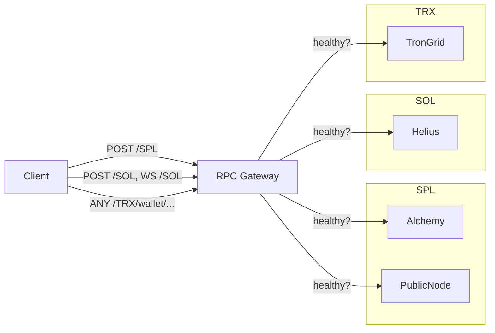

# RPC Gateway

A failover proxy in front of blockchain RPC providers. One instance serves
every configured chain from one port: each chain lives under its own URL
prefix and has its own list of upstream targets, health checks and failover.


```mermaid
flowchart LR
    C[Client] -->|POST /SPL| G[RPC Gateway]
    C -->|POST /SOL, WS /SOL| G
    C -->|ANY /TRX/wallet/...| G
    G -->|healthy?| A1[Alchemy]
    G -->|healthy?| A2[PublicNode]
    G -->|healthy?| S1[Helius]
    G -->|healthy?| T1[TronGrid]
    subgraph SPL
      A1
      A2
    end
    subgraph SOL
      S1
    end
    subgraph TRX
      T1
    end
```

A request goes to a random routable target of its chain. If the target fails
(connection error, timeout, HTTP 5xx / 429 / 401 / 403, or a response body
matching a configured *exception*) the same request is retried on another
target; the client only sees the final answer. The response header
`X-Rpc-Provider` names the target that answered.

## Routes

| Route | Purpose |
|---|---|
| `POST /{chain}` | JSON-RPC request for the chain (key is case-insensitive, e.g. `/SPL`, `/sol`) |
| `GET /{chain}` + `Upgrade: websocket` | WebSocket, proxied to the target's `ws_url` (Solana subscriptions) |
| `ANY /{chain}/{path}` | Tron only: the path and query are forwarded to the target (`/TRX/wallet/getnowblock`, `/TRX/v1/...`, `/TRX/jsonrpc`) |
| `GET /status` | JSON snapshot of every chain and target: routable, block number, lag, taint, last error |
| `GET /healthz` | Liveness for Render: `{"healthy":true}` whenever the process is up (never depends on upstreams) |

Unknown chains and routes return a JSON-RPC style error with HTTP 404. When no
target of a chain is routable the gateway answers HTTP 503 with a JSON-RPC error.

## Chain types

| `type` | Health check | Client path | Notes |
|---|---|---|---|
| `evm` | `eth_blockNumber` | ignored; the target URL is used as-is (API keys often live there) | any EVM network; `chain_id` is verified by the testnet suite |
| `solana` | `getSlot` | ignored | WebSocket goes to `ws_url` (defaults to `http_url` with ws scheme) |
| `tron` | `POST /wallet/getnowblock` | appended to the target base URL together with the query | Full Tron HTTP API; `TronWeb` can use `https://gateway/TRX` as `fullHost` |

The EVM chains shipped in [config.example.toml](config.example.toml) and in the
testnet config, with the testnet each key points at and its `chain_id`:

| Key | Network | `chain_id` |
|---|---|---|
| `SPL` | Ethereum Sepolia | `0xaa36a7` |
| `ETH` | Ethereum Sepolia | `0xaa36a7` |
| `ARB` | Arbitrum Sepolia | `0x66eee` |
| `BSC` | BNB Smart Chain testnet | `0x61` |
| `POL` | Polygon Amoy | `0x13882` |
| `AVA` | Avalanche Fuji C-Chain | `0xa869` |
| `OPT` | Optimism Sepolia | `0xaa37dc` |
| `BAS` | Base Sepolia | `0x14a34` |
| `CEL` | Celo Sepolia | `0xaa044c` |
| `SNC` | Sonic testnet | `0x3909` |
| `UNI` | Unichain Sepolia | `0x515` |
| `LIN` | Linea Sepolia | `0xe705` |
| `OKX` | OKX X Layer testnet | `0x7a0` |

`SPL` is what the backend calls Ethereum Sepolia, so `SPL` and `ETH` are the
same network under two keys. Mainnet deployments keep the keys and swap the
targets and `chain_id` in the secret config file.

## How health works

Every `interval` all targets of a chain are checked concurrently:

- `failure_threshold` consecutive failed checks (error, timeout, non-200,
  malformed answer) mark a target unhealthy; `success_threshold` consecutive
  successes bring it back.
- A target whose block number is more than `max_block_lag` behind the best
  target of the same chain is excluded until it catches up. This guards
  against providers that serve cached or stale data while "answering fine".
- A request that fails at transport/HTTP level (timeout, 5xx, 429, 401/403,
  dropped connection) is retried elsewhere **and** the target is *tainted*
  for `taint_duration` (default 15s) so the next requests skip it.
  Exception matches only retry the request: they describe a bad answer to
  one request, not a bad node.
- Client-side errors (HTTP 4xx other than the above, JSON-RPC errors that
  match no exception, Tron `{"Error": ...}` bodies) are passed through
  untouched.

Everything above is observable on `GET /status` and in the structured log
(`target unhealthy`, `target healthy`, `target tainted`, `request rerouted`,
`no healthy targets`).

## Configuration

One TOML file, see [config.example.toml](config.example.toml) for a complete,
commented example with public testnets.

```toml
[server]
port = 3000                 # PORT env overrides (Render sets it)
upstream_timeout = "5s"     # wait for a target to start answering before failover

[healthchecks]
interval = "5s"
timeout = "3s"
failure_threshold = 2
success_threshold = 1
max_block_lag = 20          # per-chain override: chains.X.max_block_lag (0 disables)
taint_duration = "15s"      # "0s" disables tainting

[[exceptions]]              # global; chains may add their own [[chains.X.exceptions]]
match = "socket hang up"
message = "optional text used in logs"

[chains.SPL]
type = "evm"
chain_id = "0xaa36a7"       # optional; testnet checks verify eth_chainId
[[chains.SPL.targets]]
name = "PublicNode"
http_url = "https://ethereum-sepolia-rpc.publicnode.com"
[[chains.SPL.targets]]
name = "Alchemy"
http_url = "https://eth-sepolia.g.alchemy.com/v2/${ALCHEMY_KEY}"
disabled = true             # kept in the file, never routed to
# compression = true        # target accepts gzip request bodies as-is
# disable_keep_alives = true
# headers = { "X-Api-Key" = "${KEY}" }   # added to every request and health check

[chains.SOL]
type = "solana"
[[chains.SOL.targets]]
name = "Public"
http_url = "https://api.devnet.solana.com"
ws_url = "wss://api.devnet.solana.com"

[chains.TRX]
type = "tron"
[[chains.TRX.targets]]
name = "TronGrid"
http_url = "https://api.shasta.trongrid.io"                  # base URL
headers = { "TRON-PRO-API-KEY" = "${TRONGRID_KEY}" }
```

Rules the loader enforces at startup (a violation is a fatal error with a
readable message): at least one chain and one target per chain, chain keys
made of `[A-Za-z0-9_-]` and unique ignoring case, target names unique per
chain, `http_url` with `http(s)://`, `ws_url` with `ws(s)://`, positive
durations, thresholds ≥ 1, no unknown keys (a typo such as `prot` fails
instead of silently falling back to a default). Explicit zero values are
replaced by defaults (`failure_threshold = 0` becomes 2); disable block lag
per chain with `max_block_lag = 0`, tainting with `taint_duration = "0s"`.

### Sources and precedence

Later sources win key by key:

1. `CONFIG_TOML_PATH` (required)
2. `SECRET_CONFIG_TOML_PATH` (optional second file, e.g. one with API keys)
3. `CONFIG_OVERRIDE_TOML` (optional inline TOML, handy for one-off overrides)
4. `PORT` (overrides `server.port`)

Any string value may reference an environment variable as `${NAME}`; an
unset name aborts startup listing what is missing. `CONFIG_TOML_SECTION`
takes only one top-level table of the files (for a TOML shared with other
services, e.g. `[rpc_gateway.*]`). Arrays of tables are replaced as a whole
when merged: a secret file can swap a chain's `targets`, not patch one entry.

### Environment variables

| Variable | Default | Meaning |
|---|---|---|
| `CONFIG_TOML_PATH` | required | base TOML file |
| `SECRET_CONFIG_TOML_PATH` | | merged on top of the base file |
| `CONFIG_OVERRIDE_TOML` | | inline TOML merged last |
| `CONFIG_TOML_SECTION` | | use only this top-level table |
| `PORT` | `server.port` | listening port |
| `LOG_LEVEL` | `info` | `debug` also logs every request and upstream attempt |
| `LOG_FORMAT` | `json` | `console` for local reading |
| `OTEL_EXPORTER_OTLP_ENDPOINT` | | set to enable OTLP export of logs and metrics (see below) |
| `OTEL_EXPORTER_OTLP_HEADERS` | | `Authorization=Basic ...` for Grafana Cloud |
| `OTEL_SERVICE_NAME`, `OTEL_RESOURCE_ATTRIBUTES`, `OTEL_METRIC_EXPORT_INTERVAL` | | standard OpenTelemetry settings |
| `OTLP_LOG_LEVEL` | `info` | minimum level of log lines exported over OTLP |

A local `.env` file is loaded if present (see [.env.example](.env.example)).

## Running locally

```bash
cp config.example.toml config.local.toml
cp .env.example .env            # CONFIG_TOML_PATH=./config.local.toml, LOG_FORMAT=console
echo 'ALCHEMY_KEY=x' >> .env    # any ${NAME} used in the config
make run
```

```bash
curl -s localhost:3000/status | python3 -c '
import json,sys
d = json.load(sys.stdin)["chains"]
for k in sorted(d):
    c = d[k]
    print(k, c["type"], "routable", c["routableTargets"], "of", len(c["targets"]))
    for t in c["targets"]:
        print("   ", t["name"], "OK" if t["routable"] else "DOWN", t["blockNumber"], t.get("lastError", "")[:60])
'
curl -s localhost:3000/SPL -H 'Content-Type: application/json' \
  -d '{"jsonrpc":"2.0","id":1,"method":"eth_chainId","params":[]}'
curl -s -X POST localhost:3000/TRX/wallet/getnowblock
```

To watch a failover, add a dead target to a chain (`http_url = "http://127.0.0.1:9"`)
and run with `LOG_LEVEL=debug`; roughly every second request will show
`request rerouted` and `target tainted` while still answering from a live target.

## Tests

```bash
make test           # unit + integration tests, offline, ~5s
make test-race      # same with the race detector (CI)
make test-testnet   # real calls through the gateway against public testnets, ~15s
```

The offline suite uses a programmable fake RPC node
([internal/testutil/fakenode](internal/testutil/fakenode)) to simulate every
failure a provider can produce: HTTP 5xx/429/403, dropped connections,
hanging or slow responses, invalid JSON, JSON-RPC errors, lagging blocks,
gzip bodies, Tron-style error bodies. Health rounds are driven synchronously
(`Manager.RunOnce`) so tests never sleep.

The testnet suite ([tests/testnet](tests/testnet)) starts the real gateway on
every chain of `tests/testnet/config.testnet.toml` — the thirteen EVM testnets
of the table above, Solana devnet and Tron Shasta — injects a dead target into
every chain, and verifies per chain type that real calls work (each EVM chain's
`eth_chainId` against the configured one, a Solana WebSocket subscription, the
Tron `/wallet`, `/v1` and `/jsonrpc` APIs), that the dead target is detected and
never used, and, in a second run, that a request landing on it is rerouted and
the target tainted. Point it at your own providers with
`TESTNET_CONFIG_TOML_PATH=... [SECRET_CONFIG_TOML_PATH=...] make test-testnet`;
`TESTNET_CHAINS=SOL,TRX` filters chains.

## Deploying on Render

[render.yaml](render.yaml) describes the single web service: Go native
runtime, `make build-render`, `./app`, health check on `/healthz`. The TOML
config is a Render **secret file** mounted at `/etc/secrets/config.toml`
(`CONFIG_TOML_PATH` points there); API keys referenced as `${NAME}` are plain
environment variables. Logs are JSON on stdout; Render keeps them 7 days on
Hobby and 14 on Pro. For longer history and dashboards, enable the OTLP
export to Grafana Cloud below.

## Observability

The core never logs on its own; it reports events to an `events.Observer`
([internal/events](internal/events)): target health changes with the reason,
taints, reroutes, chains with no healthy target, and every upstream attempt
with method, status and duration (debug level). `events.Logger` writes them
with zap, `events.Multi` fans them out to several sinks, `events.Recorder`
is used by tests. There is no Prometheus endpoint by design: nothing on
Render scrapes it, and Grafana Cloud accepts pushed OTLP data instead.

### Grafana Cloud over OTLP

Set the standard OpenTelemetry variables (Grafana Cloud stack →
Connections → OpenTelemetry (OTLP) → Configure generates them) and the
gateway pushes directly to the OTLP gateway, no agent needed:

```
OTEL_EXPORTER_OTLP_ENDPOINT=https://otlp-gateway-prod-eu-west-2.grafana.net/otlp
OTEL_EXPORTER_OTLP_HEADERS=Authorization=Basic%20<base64 of instanceId:token>
OTEL_RESOURCE_ATTRIBUTES=deployment.environment=prod
```

What is exported ([internal/telemetry](internal/telemetry)):

- **Logs**: every log line at `OTLP_LOG_LEVEL` (default `info`) or above,
  with its fields as attributes, so `chain`, `target`, `reason` are
  filterable in Loki. Health changes, taints, reroutes and "no healthy
  targets" are all `info`/`warn`/`error`; per-request lines stay at `debug`.
- **Metrics** (attributes `chain`, `target`): `rpc_gateway.upstream.requests`
  and `rpc_gateway.upstream.duration` (+ `method`, `outcome`),
  `rpc_gateway.reroutes`, `rpc_gateway.target.taints`,
  `rpc_gateway.target.health_changes`, `rpc_gateway.no_healthy_targets`,
  and gauges `rpc_gateway.target.routable`, `rpc_gateway.target.block_number`,
  `rpc_gateway.target.lag`. Tron paths are cut to two segments in `method`
  so addresses never become label values. A few hundred series at most,
  far below the free tier's 10k.

Export failures (wrong token, endpoint down) are logged to stdout as
`export error` and never affect request handling; the SDK batches and
retries. Metrics are sent every `OTEL_METRIC_EXPORT_INTERVAL` ms (default 60000).

## Dashboard

[grafana/rpc-gateway-dashboard.json](grafana/rpc-gateway-dashboard.json) is the
day-to-day view; Explore is only for ad-hoc digging. Import it once:

1. Grafana → **Dashboards** → **New** → **Import**
2. Paste the file contents (or upload it) → **Load**
3. Pick the stack's Prometheus and Loki data sources (`...-prom`, `...-logs`) → **Import**

Panels:

- **Targets** — a table with one row per upstream: chain, target, routable
  (green OK / red DOWN), latest block, lag. The same information as
  `GET /status`, sortable and filterable.
- **Routable targets per chain** — turns red when a chain has none left.
- **Requests per second** — traffic per chain, split into ok and error.
- **Reroutes, taints and outages** — the failover activity; a line on
  "NO HEALTHY" means clients were getting 503.
- **Upstream latency p95** — how slow the providers are.
- **Warnings and errors** — the log stream, click a line for its fields.

The **Chain** dropdown at the top filters every panel. Re-import the file
after changing it in the UI (Dashboard settings → JSON Model → copy back into
the repo) so the dashboard stays version-controlled.

## Layout

```
cmd/rpcgateway        main: env, logger, config, gateway lifecycle
internal/config       TOML schema, loading, merging, ${ENV} expansion, validation
internal/gateway      router (/{chain}, /status, /healthz), server lifecycle
internal/proxy        per-chain failover proxy, health manager, JSON-RPC helpers
internal/events       Observer interface, Logger, Multi, Recorder
internal/testutil     fakenode: programmable fake RPC node for tests
tests/testnet         real-network checks (build tag `testnet`)
```

## Docker

`Dockerfile` builds the same binary for anyone not using Render's native
runtime: `docker build -t rpc-gateway .` then run with `-e CONFIG_TOML_PATH=/config/config.toml`
and the file mounted.
